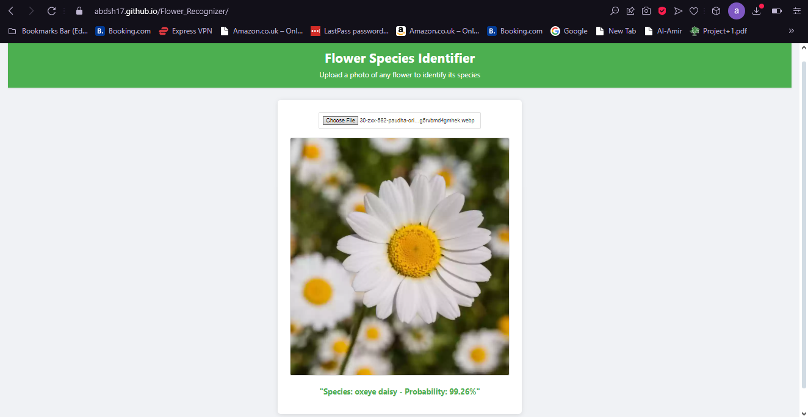

# 🌸 Flower Recognizer

A web application powered by a Neural Network (NN) using TensorFlow that can identify different flower types based on an image uploaded by the user.

## Table of Contents
- [How to Access](#How-to-Access)
- [More About The Site](#More-About-The-Site)
- [Sample Images](#Sample-Images)
- [Project Dependencies](#Project-Dependencies)


## How to Access
### 1- Through Server:
- Run the Following: https://abdsh17.github.io/Flower_Recognizer/
- It's not always accessible, Sometimes the server shutdown (free server ): )
- you always can contact me to re-open the server (:

### 2- Through local host
- Download The Repo to your local computer
- Run `Flower_Recognizer/index.html` that is inside the dictionary on your local web host
- Run app.py
- enjoy

## More About The Site

**Flower Recognizer** is a web application powered by a Neural Network (NN) using TensorFlow that can identify different flower types based on an image uploaded by the user.

### 1️- AI Module

The AI model was trained using **TensorFlow** with the [Oxford Flowers 102 dataset](https://www.tensorflow.org/datasets/catalog/oxford_flowers102), which contains images of 102 flower species. The dataset is split as follows:

- **Training Set:** 6,149 labeled images  
- **Validation Set:** 1,020 labeled images  
- **Testing Set:** 1,020 labeled images  

To improve accuracy, I utilized a **pre-trained MobileNetV2 model** from [TensorFlow Hub](https://tfhub.dev/google/tf2-preview/mobilenet_v2/feature_vector/4), freezing its weights and attaching my custom classifier on top.

The neural network was trained for **12 epochs** using:
- **Optimizer:** `Adam`
- **Loss Function:** `SGD`
- **Early Stopping:** 5 patience

After training, the model achieved **90% accuracy** on the test set and was saved in **H5 format** for deployment.

### Model Architecture:


</br> you can see the full module through the (`Report-Flower_Recognizer_Module.pdf`)
---

### 2️- Frontend

The user interface (`index.html`) is hosted on **GitHub Pages** and developed using:
- **HTML/CSS** for structure and styling  
- **JavaScript** to interact with the backend  

---

### 3- Backend

The backend (`app.py`) is implemented in **Python** using **Flask** to:
- Handle image uploads  
- Preprocess the image  
- Run model inference  
- Return the predicted flower name  

The application is deployed on **Render**, ensuring seamless hosting and accessibility.

---

## Sample Images
samples tooked from the online server
### sample1

### sample2


## Project Dependencies

The following Python packages are required for this project:

- `flask`
- `tensorflow`
- `tensorflow-hub`
- `numpy`
- `pandas`
- `pillow`
- `gunicorn`

### Installation

To install all required dependencies, run on your terminal:

```bash
pip install -r requirements.txt
